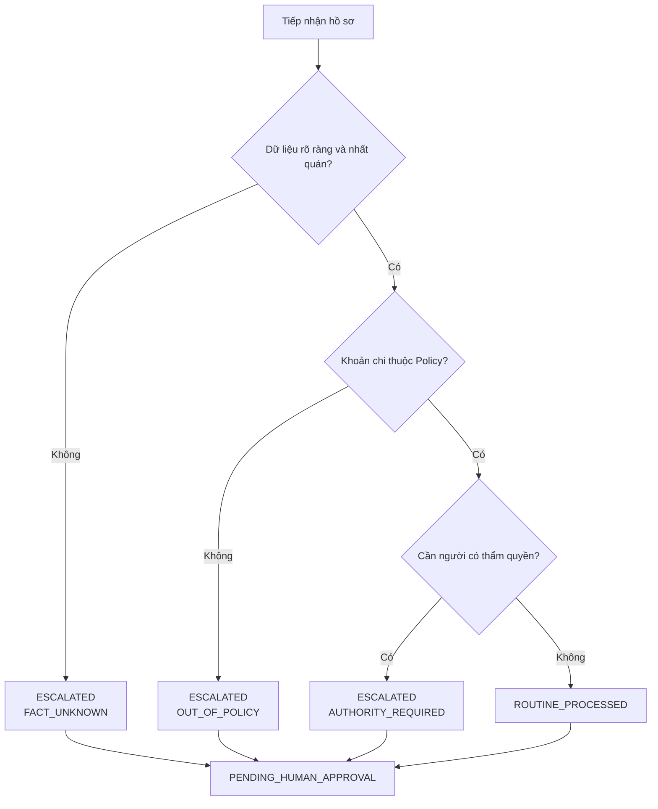

# POLICY XỬ LÝ HỒ SƠ HOÀN ỨNG CÂU LẠC BỘ

*Quyết toán tạm ứng • Hoàn trả khoản thành viên chi hộ*

Nguồn quy tắc cho agent hỗ trợ thủ quỹ — Task A

> **Cách sử dụng tài liệu:** Đây là nguồn Policy dành cho con người, được đọc, review và chỉnh sửa trực tiếp trên GitHub. Nếu thay đổi logic nghiệp vụ, phải đồng bộ `policy_rules.yaml`, `reimbursement.schema.json` và các bộ kiểm thử liên quan.

| Thuộc tính | Giá trị |
| --- | --- |
| Mã Policy | POL-REIMB-CLB |
| Phiên bản | 1.2.0 |
| Ngày rà soát nguồn | 12/09/2026 |
| Trạng thái | Mẫu chờ đơn vị chủ quản phê duyệt |
| Đơn vị chủ quản | CẦN XÁC NHẬN TRƯỚC KHI PILOT |

Thông báo áp dụng

Tài liệu này là mẫu quy định nội bộ, không phải ý kiến pháp lý. Câu lạc bộ sinh viên thường không phải đơn vị kế toán độc lập; quy chế của trường, Đoàn, Hội hoặc đơn vị chủ quản có quyền ưu tiên. Agent không phê duyệt, từ chối hoặc trực tiếp chuyển tiền và không thể hợp thức hóa khoản chi trái pháp luật.

Phạm vi dữ liệu: chỉ dùng dữ liệu tổng hợp trong kho công khai. Hồ sơ thật phải nằm trong môi trường được phê duyệt, có phân quyền và thời hạn lưu trữ.

## Sơ đồ xử lý

Sơ đồ chỉ mô tả kết quả xử lý của agent. Mọi nhánh đều kết thúc ở trạng thái chờ con người phê duyệt; agent không phê duyệt, từ chối hoặc chuyển tiền.

## 1. Mục đích, phạm vi và nguyên tắc

Policy chuẩn hóa cách tiếp nhận, kiểm tra, tính toán, phân loại kết quả xử lý, chuyển tiếp và ghi nhật ký đối với hai nghiệp vụ tài chính của câu lạc bộ.

### 1.1 Phạm vi nghiệp vụ

- ADVANCE_SETTLEMENT — quyết toán khoản câu lạc bộ đã tạm ứng cho thành viên thực hiện nhiệm vụ.
- MEMBER_PAID — hoàn trả khoản thành viên đã dùng tiền cá nhân chi hộ hoạt động được duyệt.
- Không điều chỉnh quy trình mua sắm, lựa chọn nhà cung cấp, thuế hoặc chế độ kế toán của đơn vị chủ quản; các quy trình đó được viện dẫn khi áp dụng.

### 1.2 Nguyên tắc cốt lõi

| Nguyên tắc | Yêu cầu vận hành |
| --- | --- |
| Ba lớp quy định | (1) Pháp luật bắt buộc; (2) quy chế đơn vị chủ quản; (3) quy tắc nội bộ CLB. |
| Ưu tiên hạn chế hơn | Pháp luật không được ghi đè. Xung đột nội bộ phải dùng phương án hạn chế hơn và chuyển người có thẩm quyền. |
| Không khẳng định khi nghi vấn | Bất kỳ dữ liệu mờ, mâu thuẫn, thiếu hoặc nghi trùng đều dẫn đến ESCALATED / FACT_UNKNOWN. |
| Tách xử lý và phê duyệt | ROUTINE_PROCESSED chỉ nghĩa là agent đã kiểm tra, tính toán và lập gói; approval_status luôn là PENDING_HUMAN_APPROVAL. |
| Tách nhiệm vụ | Người đề nghị không tự phê duyệt hồ sơ của mình; xung đột lợi ích phải chuyển người độc lập. |
| Truy vết | Mọi đầu vào, quy tắc, bằng chứng, kết quả xử lý, chuyển tiếp, pause, override, undo, quyết định con người và settlement phải có audit event. |

### 1.3 Thuật ngữ

| Thuật ngữ | Định nghĩa dùng trong Policy |
| --- | --- |
| Hoàn ứng | Tên gọi chung trong tài liệu cho quyết toán tạm ứng và hoàn trả chi hộ. |
| Chứng từ | Hóa đơn, biên nhận, bằng chứng thanh toán, quyết định/phê duyệt và tài liệu liên quan. |
| Dữ kiện đã xác minh | Thông tin đọc được, nhất quán và được đối chiếu với bằng chứng đủ tin cậy. |
| Khoản liên quan | Các dòng cùng nhà cung cấp chuẩn hóa, ngày giao dịch và mục đích; phải cộng gộp trước khi kiểm tra ngưỡng. |
| Ngoại lệ | Chấp thuận có thẩm quyền cho quy tắc nội bộ cho phép ngoại lệ; không áp dụng với điều cấm pháp luật. |

## 2. Cơ sở, thứ bậc và điều kiện áp dụng

Các nguồn dưới đây được đối chiếu đến 12/09/2026. Người triển khai phải kiểm tra lại hiệu lực và phạm vi áp dụng khi cấu hình cho đơn vị cụ thể.

| Lớp | Nguồn tham chiếu | Cách dùng |
| --- | --- | --- |
| 1 — Bắt buộc | Luật Kế toán 88/2015/QH13 | Tính đầy đủ, trung thực, hợp pháp của chứng từ; trách nhiệm và lưu trữ. |
| 1 — Bắt buộc | Quy định hóa đơn, chứng từ hiện hành; Luật Bảo vệ dữ liệu cá nhân 91/2025/QH15 | Hóa đơn điện tử/chứng từ và bảo vệ dữ liệu theo phạm vi áp dụng. |
| 1 — Có điều kiện thuế | Nghị định 320/2025/NĐ-CP và hướng dẫn liên quan | Kiểm tra chứng từ thanh toán không dùng tiền mặt từ 5 triệu đồng khi chế độ thuế tương ứng áp dụng. |
| 2 — Đơn vị chủ quản | Chế độ kế toán và quy chế tài chính/mua sắm của trường, Đoàn, Hội | Quyết định mẫu biểu, thẩm quyền, hồ sơ, ngân sách và lưu trữ thực tế. |
| 3 — Nội bộ CLB | Policy này và OrganizationProfile | Mặc định vận hành; chỉ có hiệu lực sau khi được đơn vị chủ quản xác nhận. |

### 2.1 Danh mục URL chính thức

- [Luật Kế toán 88/2015/QH13](https://vbpl.vn/TW/Pages/vbpq-toanvan.aspx?ItemID=95924)
- [Thông tư 99/2025/TT-BTC](https://vbpl.vn/TW/Pages/vbpq-van-ban-goc.aspx?ItemID=187356)
- [Thông tư 24/2024/TT-BTC](https://vbpl.vn/TW/Pages/vbpq-luocdo.aspx?ItemID=166774)
- [Nghị định 320/2025/NĐ-CP](https://vanban.chinhphu.vn/?classid=0&docid=216219&pageid=27160)
- [Văn bản hóa đơn, chứng từ tham chiếu](https://vanban.chinhphu.vn/?classid=1&docid=218020&orggroupid=2&pageid=27160)
- [Luật Bảo vệ dữ liệu cá nhân 91/2025/QH15](https://congbao.chinhphu.vn/van-ban/luat-so-91-2025-qh15-45578.htm)

Tương thích mẫu: trường thông tin trong phụ lục được thiết kế để dễ ánh xạ với Giấy thanh toán tiền tạm ứng 04-TT và Giấy đề nghị thanh toán 05-TT của Thông tư 99/2025/TT-BTC. Điều này không mặc định Thông tư 99 áp dụng trực tiếp cho mọi CLB.

## 3. Vai trò, trách nhiệm và phân tách nhiệm vụ

| Vai trò | Trách nhiệm | Không được làm |
| --- | --- | --- |
| Người đề nghị | Khai trung thực; nộp chứng từ; trả lời yêu cầu; hoàn tiền thừa. | Tự phê duyệt hồ sơ của mình. |
| Agent | Đọc, chuẩn hóa, đối chiếu, tính toán, phân loại đầu ra, tạo chuyển tiếp và audit. | Phê duyệt; từ chối; chuyển tiền; tự tạo dữ kiện; bỏ qua cờ nghi vấn; ghi đè pháp luật. |
| Thủ quỹ | Kiểm soát nghiệp vụ, xác nhận gói, thực hiện/khởi tạo thanh toán được ủy quyền. | Duyệt hồ sơ của mình hoặc giải ngân khi thiếu phê duyệt. |
| Chủ nhiệm | Phê duyệt vượt ngưỡng; chỉ định người độc lập khi xung đột. | Hợp thức hóa khoản chi trái pháp luật. |
| Cố vấn/đơn vị chủ quản | Xác nhận cấu hình, chế độ áp dụng, ngoại lệ nhạy cảm và lưu trữ. | Phê duyệt thiếu dấu vết/lý do. |
| Quản trị hệ thống | Phân quyền, bảo mật, sao lưu, giám sát, pause hệ thống theo ủy quyền. | Sửa kết quả tài chính hoặc phê duyệt hồ sơ khi không có thẩm quyền. |

### 3.1 Ma trận xử lý và thẩm quyền mặc định

| Tình huống | Chủ thể | Kết quả |
| --- | --- | --- |
| Hồ sơ sạch, tổng ≤ 5.000.000 | Agent + thủ quỹ kiểm soát | ROUTINE_PROCESSED; lập gói để con người phê duyệt. |
| Tổng > 5.000.000 | Chủ nhiệm | ESCALATED / AUTHORITY_REQUIRED. |
| Vượt ngân sách / xung đột | Người có thẩm quyền độc lập | ESCALATED / AUTHORITY_REQUIRED. |
| Dữ kiện chưa rõ | Người đề nghị/nhà cung cấp/thủ quỹ | ESCALATED / FACT_UNKNOWN; trả lời có bằng chứng. |
| Ngoài Policy | Chủ nhiệm +/hoặc cố vấn theo danh mục | ESCALATED / OUT_OF_POLICY; người có thẩm quyền xem xét ngoại lệ nếu được phép. |
| Trùng đã thanh toán, xác minh chắc chắn | Người có thẩm quyền | ESCALATED / OUT_OF_POLICY; agent không tự từ chối. |

## 4. Thành phần hồ sơ tiêu chuẩn

### 4.1 Thành phần chung

| # | Thành phần | Kiểm tra tối thiểu |
| --- | --- | --- |
| 1 | Thông tin người đề nghị | Mã thành viên, họ tên, vai trò, kênh liên hệ. |
| 2 | Nhiệm vụ/sự kiện và mục đích | Liên kết với hoạt động, kế hoạch hoặc quyết định đã duyệt. |
| 3 | Ngân sách | Mã ngân sách, mức duyệt, số còn lại, phê duyệt ban đầu. |
| 4 | Bảng kê từng khoản | Ngày, nhà cung cấp, nội dung, danh mục, số tiền, thuế, phương thức. |
| 5 | Hóa đơn/chứng từ | Đọc được, hợp lệ theo chế độ áp dụng, không trùng. |
| 6 | Bằng chứng thanh toán | Khớp người trả, người nhận, số tiền, ngày, nội dung. |
| 7 | Tài khoản nhận | Tên tài khoản, ngân hàng, số đã xác minh; che bớt trong log. |
| 8 | Phê duyệt liên quan | Đúng vai trò, không xung đột, có thời gian và lý do khi ngoại lệ. |

### 4.2 Theo luồng

| Luồng | Bắt buộc bổ sung | Kết quả tính |
| --- | --- | --- |
| Quyết toán tạm ứng | Mã/chứng từ tạm ứng; số tiền tạm ứng; ngày nhận; biên bản trả tiền thừa nếu có. | Chi hợp lệ; phải hoàn lại; cần thanh toán bổ sung. |
| Thành viên chi hộ | Bằng chứng người đề nghị đã thực trả; cam kết chưa yêu cầu hoàn ở nơi khác. | Tổng hoàn trả bằng tổng dòng đủ điều kiện đề xuất. |

### 4.3 Tiêu chuẩn dữ liệu và OCR

- Không suy đoán số hóa đơn, ngày, nhà cung cấp hoặc số tiền bị che/mờ.
- Lưu cả giá trị trích xuất, độ tin cậy, vùng nguồn và trạng thái xác minh; hash tệp dùng để so trùng.
- Nếu bảng kê và chứng từ chênh lệch, nêu rõ số chênh và yêu cầu xác nhận/chứng từ thay thế.
- Tệp có dấu hiệu chỉnh sửa, trùng hoặc gian lận chỉ là nghi vấn cho đến khi kiểm tra; khi đó dùng ESCALATED / FACT_UNKNOWN.

## 5. Quy trình xử lý chuẩn

1. Tiếp nhận và gán mã hồ sơ; xác định ADVANCE_SETTLEMENT hay MEMBER_PAID.
2. Kiểm tra tệp mở được, khả năng đọc, trường bắt buộc, chữ ký/phê duyệt và tính nhất quán.
3. Đối chiếu người đề nghị với nhiệm vụ, sự kiện, kế hoạch và ngân sách đã duyệt.
4. Đối chiếu hóa đơn, bằng chứng thanh toán, hash/chỉ số trùng và các khoản liên quan.
5. Phân loại từng khoản: được phép, có điều kiện, ngoài Policy hoặc bị pháp luật cấm.
6. Cộng gộp cùng nhà cung cấp–ngày–mục đích; áp dụng ngân sách, xung đột và ngưỡng thẩm quyền.
7. Khi chế độ thuế tương ứng áp dụng, kiểm tra điều kiện thanh toán không dùng tiền mặt ở ngưỡng hiện hành.
8. Chỉ tính trên dòng đã xác minh; tạo ROUTINE_PROCESSED hoặc ESCALATED kèm đúng một trong ba loại chuyển tiếp.
9. Sinh bộ hồ sơ, giải thích bằng tiếng Việt và AuditEvent; không giải ngân trực tiếp.
10. Sau phê duyệt, thủ quỹ thu hồi tiền thừa hoặc thanh toán bổ sung/hoàn trả; gắn bằng chứng kết thúc.

### 5.1 Điểm dừng bắt buộc

| Tín hiệu | Kết quả / loại | Hành động |
| --- | --- | --- |
| Tệp mờ/thiếu/mâu thuẫn/nghi trùng | ESCALATED / FACT_UNKNOWN | Hỏi đúng dữ kiện, nêu bằng chứng liên quan, chờ trả lời. |
| Danh mục ngoài phạm vi, không gồm rượu/bia | ESCALATED / OUT_OF_POLICY | Chuyển đúng một CLUB_CHAIR để quyết định hướng xử lý; agent không tự động chấp nhận. |
| Vượt ngưỡng/ngân sách/xung đột | ESCALATED / AUTHORITY_REQUIRED | Gửi đúng người có thẩm quyền với lựa chọn rõ ràng. |
| Đã xác minh trùng và đã thanh toán | ESCALATED / OUT_OF_POLICY | Chuyển đúng một CLUB_CHAIR xác nhận hướng xử lý; agent không tự từ chối. |
| Lệnh dừng hợp lệ | control_state = PAUSED | Dừng vận hành và ghi audit; đây không phải nhãn dự đoán. |

## 6. Quy tắc phân loại đầu ra và thứ tự ưu tiên

| Ưu tiên | Nhóm | Ví dụ rule ID | Đầu ra chủ đạo |
| --- | --- | --- | --- |
| 10–22 | Pause & toàn vẹn dữ liệu | RULE-SYS-001; RULE-FACT-001..003 | control_state=PAUSED hoặc ESCALATED/FACT_UNKNOWN |
| 30–31 | Trùng lặp | RULE-DUP-001..002 | ESCALATED/FACT_UNKNOWN hoặc ESCALATED/OUT_OF_POLICY |
| 40–44 | Phạm vi & danh mục | RULE-SCOPE-001..002; RULE-CAT-001..003 | ESCALATED/OUT_OF_POLICY hoặc ESCALATED/AUTHORITY_REQUIRED |
| 50–55 | Hồ sơ & thời hạn | RULE-DOC-001; RULE-DEADLINE-001 | ESCALATED/FACT_UNKNOWN hoặc ESCALATED/AUTHORITY_REQUIRED |
| 60–63 | Ngân sách & thẩm quyền | RULE-BUDGET/CONFLICT/AGG/AUTH | ESCALATED/AUTHORITY_REQUIRED hoặc tiếp tục cộng gộp |
| 70 | Điều kiện thuế | RULE-TAX-001 | ESCALATED/FACT_UNKNOWN khi điều kiện áp dụng |
| 80–90 | Tính toán & hoàn tất | RULE-CALC-001..002; RULE-ROUTINE-001 | ROUTINE_PROCESSED |

### 6.1 Hợp đồng đầu ra

| Thành phần đầu ra | Giá trị | Quy tắc |
| --- | --- | --- |
| processing_result | ROUTINE_PROCESSED | Đã xử lý thường quy; escalation_type = null. |
| processing_result | ESCALATED | Bắt buộc tạo Escalation. |
| escalation_type | FACT_UNKNOWN / OUT_OF_POLICY / AUTHORITY_REQUIRED | Chỉ đúng ba loại theo đề thi. |
| approval_status | PENDING_HUMAN_APPROVAL | Cố định cho mọi hồ sơ; agent không phê duyệt/từ chối. |
| control_state | ACTIVE / PAUSED | Trạng thái vận hành riêng, không phải nhãn dự đoán. |
| Quyền của agent | NO_APPROVE / NO_REJECT / NO_TRANSFER | Chỉ kiểm tra, tính toán, phân loại và lập gói. |

## 7. Danh mục chi, ngưỡng và cộng gộp

| Nhóm | Mặc định | Cách xử lý |
| --- | --- | --- |
| Được phép | Địa điểm, vận chuyển, in ấn, vật tư, truyền thông, ăn uống đã duyệt, dịch vụ đã duyệt | Tiếp tục nếu hồ sơ đầy đủ. |
| Có điều kiện | Quà tặng, thù lao, thiết bị, nộp muộn | ESCALATED / AUTHORITY_REQUIRED nếu thiếu phê duyệt/chứng từ theo OrganizationProfile. |
| Ngoài Policy, không gồm rượu/bia | Thuốc lá, chi cá nhân và danh mục không được công nhận | ESCALATED / OUT_OF_POLICY đến đúng một CLUB_CHAIR. |
| Rượu/bia | Rượu/bia | ESCALATED / OUT_OF_POLICY đến đúng một CLUB_CHAIR sau khi có tham vấn PARENT_ADVISOR được ghi audit; tham vấn là điều kiện tiên quyết, không phải quyết định thứ hai của agent. |
| Bị pháp luật cấm | Hàng hóa/dịch vụ bất hợp pháp | ESCALATED / OUT_OF_POLICY đến đúng một CLUB_CHAIR; không ngoại lệ, phê duyệt nội bộ không thể hợp thức hóa. |

### 7.1 Mặc định có thể cấu hình

| Biến | Mặc định | Ý nghĩa |
| --- | --- | --- |
| currency | VND | Không tự đổi ngoại tệ nếu chưa có tỷ giá/quy tắc được duyệt. |
| submission_deadline_business_days | 10 | Sau kết thúc nhiệm vụ/phát sinh khoản chi; nộp muộn chuyển thẩm quyền. |
| routine_processing_max_vnd | 5.000.000 | Tổng ≤ ngưỡng được xử lý thường quy; tổng > ngưỡng chuyển Chủ nhiệm. Mọi hồ sơ vẫn chờ con người phê duyệt. |
| non_cash_evidence_threshold_vnd | 5.000.000 | Ngưỡng kiểm tra điều kiện chứng từ thuế khi chế độ tương ứng áp dụng; không phải ngưỡng duyệt. |
| aggregation_keys | Nhà cung cấp + ngày + mục đích | Ngăn chia nhỏ giao dịch trước khi kiểm tra ngưỡng. |
| no_self_approval | true | Người đề nghị và người duyệt phải độc lập. |

### 7.2 Quy tắc biên

- 4.999.999 đồng: trong ngưỡng xử lý thường quy nếu mọi điều kiện khác đạt; phê duyệt vẫn thuộc con người.
- 5.000.000 đồng: vẫn trong ngưỡng xử lý thường quy vì toán tử nội bộ là “lớn hơn”; phê duyệt vẫn thuộc con người và phải kiểm tra bằng chứng không dùng tiền mặt nếu điều kiện thuế áp dụng.
- 5.000.001 đồng: ESCALATED / AUTHORITY_REQUIRED theo mặc định.
- Hai khoản 3.000.000 đồng cùng nhà cung cấp, ngày và mục đích được cộng thành 6.000.000 đồng trước khi xét thẩm quyền và điều kiện thuế.

## 8. Công thức và kết quả tài chính

### 8.1 Dữ liệu đầu vào phép tính

- Chỉ cộng dòng có `line_assessment = ELIGIBLE` và không còn cờ nghi vấn.
- Khoản được đánh giá không đủ điều kiện vẫn lưu trong bảng kê với rule ID và lý do; không xóa khỏi dấu vết.
- Số tiền là số nguyên VND; quy tắc làm tròn khác phải do đơn vị chủ quản cấu hình.

### 8.2 Công thức

| Luồng | Công thức | Diễn giải |
| --- | --- | --- |
| Cả hai | eligible_total = Σ eligible line amounts | Tổng chi đủ điều kiện đề xuất. |
| Tạm ứng | balance = advance_amount − eligible_total | Số dương: người nhận tạm ứng còn giữ tiền. |
| Tạm ứng | amount_to_return = max(balance, 0) | Số phải hoàn lại cho CLB. |
| Tạm ứng | additional_payment = max(−balance, 0) | Số CLB cần thanh toán bổ sung. |
| Chi hộ | reimbursement_amount = eligible_total | Số hoàn trả cho thành viên. |

### 8.3 Ví dụ

| Tình huống | Dữ liệu | Kết quả |
| --- | --- | --- |
| Tạm ứng còn thừa | Tạm ứng 3.000.000; chi hợp lệ 2.400.000 | Hoàn lại 600.000; bổ sung 0. |
| Tạm ứng thiếu | Tạm ứng 1.200.000; chi hợp lệ 1.500.000 | Hoàn lại 0; bổ sung 300.000. |
| Chi hộ | Chi hợp lệ 850.000 | Hoàn trả 850.000. |

Mọi con số trong kết quả xử lý phải chỉ ra dòng chi và bằng chứng nguồn. Nếu phép cộng không khớp bảng kê hoặc chứng từ, chuyển ESCALATED / FACT_UNKNOWN thay vì tự sửa.

## 9. Chuyển tiếp có cấu trúc

Mỗi chuyển tiếp phải đủ ngữ cảnh để người nhận trả lời mà không mở lại toàn bộ hồ sơ.

| Trường bắt buộc | Nội dung |
| --- | --- |
| type | FACT_UNKNOWN, OUT_OF_POLICY hoặc AUTHORITY_REQUIRED. |
| addressee_role | Vai trò/người thực sự có thể cung cấp sự thật hoặc quyết định. |
| related_evidence | Mã dòng, hóa đơn, tệp, phê duyệt và hash liên quan. |
| known_facts | Mã hồ sơ, số tiền, ngưỡng, ngân sách, dữ kiện đã xác minh. |
| specific_question | Một câu hỏi cụ thể, tránh “vui lòng kiểm tra”. |
| response_format | Lựa chọn hoặc định dạng bằng chứng/câu trả lời. |
| resume_action | Agent sẽ chạy lại bước/rule nào sau khi nhận trả lời. |

### 9.1 Mẫu câu hỏi tốt

FACT_UNKNOWN — Hồ sơ TC-F01, hóa đơn E-01 khai 900.000 đồng nhưng ảnh chỉ có OCR 43% và không đọc được tổng tiền. Vui lòng tải PDF/ảnh rõ toàn bộ hóa đơn hoặc xác nhận hủy dòng chi. Sau khi nhận, agent sẽ đọc lại E-01, đối chiếu bảng kê và chạy kiểm tra trùng.

AUTHORITY_REQUIRED — Hồ sơ TC-A01 có tổng đã xác minh 5.000.001 đồng, vượt ngưỡng xử lý thường quy 5.000.000 đồng 1 đồng và vẫn trong ngân sách. Chủ nhiệm chọn APPROVE hoặc REJECT và ghi lý do. Agent sẽ ghi audit rồi tiếp tục lập gói hoặc kết thúc hồ sơ.

### 9.2 Quy tắc tiếp tục

- Câu trả lời chỉ hợp lệ nếu đúng người/vai trò, có thời gian và bằng chứng cần thiết.
- Nếu câu trả lời tạo mâu thuẫn mới, giữ ESCALATED / FACT_UNKNOWN và hỏi phần còn thiếu; không tự chọn một phiên bản.
- Phê duyệt ngoại lệ của con người không làm mất dấu chuyển tiếp OUT_OF_POLICY ban đầu; tạo kết quả xử lý mới liên kết audit trước.

## 10. Audit, pause, override và undo

| Sự kiện | Nội dung tối thiểu |
| --- | --- |
| RECEIVED | Thời gian, nguồn, actor, policy/profile version, input hash. |
| VALIDATED | Kết quả schema/OCR/đối chiếu; lỗi và cờ nghi vấn. |
| RULE_TRIGGERED | Rule ID, priority, điều kiện, bằng chứng, kết quả. |
| CLASSIFIED | Outcome ID, processing_result, escalation_type, approval_status, số tiền, giải thích, tác nhân tạo. |
| PAUSED / RESUMED | Người có thẩm quyền, phạm vi, lý do, thời gian hiệu lực. |
| OVERRIDDEN | Người thực hiện, vai trò, lý do, kết quả trước; không cho override luật. |
| UNDONE | Sự kiện bị hoàn tác, người/lý do; tạo sự kiện bù, không xóa lịch sử. |
| HUMAN_DECISION | Actor là con người, vai trò, lý do, kết quả trước và quyết định. |
| SETTLEMENT | Actor là con người, vai trò, lý do, sự kiện quyết định trước đó và bằng chứng settlement. |

### 10.1 Bất biến kiểm soát

- Audit append-only; mọi sửa đổi được biểu diễn bằng sự kiện mới.
- Input snapshot/hash và policy_version phải đủ để tái lập kết quả phân loại.
- Cùng đầu vào chuẩn hóa + cùng OrganizationProfile + cùng Policy phải cho cùng kết quả.
- Pause áp dụng trước mọi quy tắc khác. Resume không xóa cảnh báo hay phê duyệt đang thiếu.
- Override chỉ với quy tắc nội bộ cho phép; phải có actor_id, actor_role, reason, timestamp và previous_outcome_id.

### 10.2 Giải thích cho người dùng

Mỗi kết quả xử lý phải nêu: processing_result; escalation_type; approval_status; số đủ điều kiện/hoàn lại/bổ sung; rule ID; bằng chứng đã dùng; bước tiếp theo; người chịu trách nhiệm. Không hiển thị toàn bộ số tài khoản hoặc dữ liệu cá nhân không cần thiết.

## 11. Bảo vệ dữ liệu và vận hành

| Kiểm soát | Yêu cầu mặc định |
| --- | --- |
| Tối thiểu hóa | Chỉ thu dữ liệu cần cho kiểm tra, phê duyệt, thanh toán, kế toán và kiểm toán. |
| Phân quyền | Người đề nghị chỉ xem hồ sơ của mình; thủ quỹ/người duyệt theo phạm vi; admin không mặc nhiên có quyền nội dung. |
| Che dữ liệu | Log/UI chỉ hiển thị tài khoản dạng che bớt; không commit hồ sơ thật, token hoặc bí mật. |
| Mã hóa | Mã hóa khi truyền/lưu theo tiêu chuẩn hệ thống của đơn vị chủ quản. |
| Lưu trữ | Hồ sơ kế toán chính thức theo luật/quy chế đơn vị; bản OCR tạm mặc định 30 ngày rồi xóa an toàn. |
| Ứng phó | Ghi nhận truy cập; có quy trình báo sự cố, khóa quyền và bảo toàn bằng chứng. |
| Nhà cung cấp AI | Chỉ dùng nhà cung cấp/mô hình được phê duyệt; cấu hình không huấn luyện trên dữ liệu nếu yêu cầu. |

### 11.1 Mức dịch vụ nội bộ gợi ý

| Mốc | Mặc định gợi ý | Cấu hình |
| --- | --- | --- |
| Agent kiểm tra ban đầu | Ngay sau khi nhận hồ sơ | Theo tải hệ thống |
| Người có thẩm quyền phản hồi | 2 ngày làm việc | Đơn vị chủ quản xác nhận |
| Người đề nghị bổ sung | 5 ngày làm việc | Có thể gia hạn bằng audit |
| Thủ quỹ xử lý sau duyệt | 3 ngày làm việc | Không cam kết chuyển tiền nếu tài khoản lỗi |

### 11.2 Chỉ số chất lượng

- Tỷ lệ bỏ sót chuyển tiếp = ca cần chuyển tiếp nhưng bị phân loại ROUTINE_PROCESSED / tổng ca cần chuyển tiếp.
- Tỷ lệ chuyển tiếp không cần thiết = ca thường quy bị chuyển tiếp / tổng ca thường quy.
- Theo dõi thêm: thời gian xử lý, tỷ lệ hồ sơ phải bổ sung, lỗi tính toán, override, khiếu nại và drift theo phiên bản.

## 12. Ánh xạ hệ thống và tiêu chí nghiệm thu

| Thành phần | Tệp/đối tượng | Hợp đồng |
| --- | --- | --- |
| Cấu hình | OrganizationProfile | Ngưỡng, chế độ, danh mục, vai trò; không hard-code ngoài profile. |
| Hồ sơ | ReimbursementCase | Hai flow; từng line; Evidence; OCR/duplicate; tài khoản che bớt. |
| Quy tắc | policy_rules.yaml | ID, priority, source, condition, result, testable. |
| Kết quả xử lý | ProcessingOutcome | processing_result, escalation_type, approval_status, số tiền, rule IDs, evidence và giải thích. |
| Chuyển tiếp | Escalation | Ba loại; câu hỏi đủ ngữ cảnh; định dạng trả lời; resume action. |
| Truy vết | AuditEvent | Append-only; policy/input hash; pause/override/undo/HUMAN_DECISION/SETTLEMENT. |

### 12.1 Verify bắt buộc

| Tiêu chí | Ngưỡng đạt |
| --- | --- |
| Ba hồ sơ thường quy | 3/3 ROUTINE_PROCESSED; approval_status vẫn PENDING_HUMAN_APPROVAL. |
| Hai hồ sơ chuyển tiếp | 2/2 ESCALATED và đúng một trong ba escalation_type. |
| Dữ liệu nghi vấn | 0 kết luận khẳng định; 0 phê duyệt/từ chối bởi agent. |
| Câu hỏi | Đủ dữ kiện để trả lời mà không mở toàn bộ hồ sơ. |
| Tính lặp lại | Cùng input/profile/policy cho cùng output. |
| Sai số chuyển tiếp | Missed escalation rate = 0%; unnecessary escalation rate = 0% trên Verify. |

### 12.2 Checklist trước vận hành thật

- ☐ Đơn vị chủ quản và chế độ kế toán/thuế đã được xác nhận bằng văn bản.
- ☐ Ngưỡng, ngân sách, danh mục, vai trò và SLA đã được cấu hình/phê duyệt.
- ☐ Đã kiểm thử 29 ca tổng hợp và 5 ca Verify; đã kiểm thử quyền truy cập và pause.
- ☐ Đã có quy trình khiếu nại, sửa sai, hoàn tác, lưu trữ và ứng phó sự cố.
- ☐ Đã đào tạo thủ quỹ/người duyệt rằng ROUTINE_PROCESSED không phải phê duyệt hoặc lệnh chuyển tiền.

## PHỤ LỤC A — PHIẾU ĐỀ NGHỊ QUYẾT TOÁN TẠM ỨNG

Mã biểu: FRM-ADV-01 | Dùng cho ADVANCE_SETTLEMENT

| Trường | Nội dung điền |
| --- | --- |
| Mã hồ sơ | ____________________________ |
| Người đề nghị | Họ tên: __________________ Mã thành viên: __________ Vai trò: __________ |
| Nhiệm vụ/sự kiện | ____________________________________________________________ |
| Mục đích tạm ứng | ____________________________________________________________ |
| Mã ngân sách | ________________ Phê duyệt ban đầu số: __________________ |
| Ngày nhận tạm ứng | ____/____/______ |
| Số tiền tạm ứng | ________________ VND (Bằng chữ: ____________________________) |
| Tổng chi đề nghị | ________________ VND |
| Tài khoản nhận bổ sung | Chủ TK: ______________ Ngân hàng: __________ Số TK: __________ |

### Kết quả đối chiếu

| Chỉ tiêu | Số tiền VND |
| --- | --- |
| Tổng chi đủ điều kiện đề xuất | ________________ |
| Tiền phải hoàn lại CLB | ________________ |
| CLB cần thanh toán bổ sung | ________________ |

Cam kết: Tôi xác nhận thông tin và chứng từ là trung thực; chưa dùng để thanh toán ở hồ sơ khác; đồng ý hoàn tiền thừa theo kết quả được duyệt.

| Người đề nghị | Người kiểm soát | Người phê duyệt |
| --- | --- | --- |
| Ký, ghi rõ họ tên Ngày: ____/____/______ | Ký, ghi rõ họ tên Ngày: ____/____/______ | Ký, ghi rõ họ tên Ngày: ____/____/______ |

## PHỤ LỤC B — PHIẾU ĐỀ NGHỊ HOÀN TRẢ KHOẢN CHI HỘ

Mã biểu: FRM-REIMB-01 | Dùng cho MEMBER_PAID

| Trường | Nội dung điền |
| --- | --- |
| Mã hồ sơ | ____________________________ |
| Người đề nghị | Họ tên: __________________ Mã thành viên: __________ Vai trò: __________ |
| Nhiệm vụ/sự kiện | ____________________________________________________________ |
| Mục đích chi | ____________________________________________________________ |
| Mã ngân sách | ________________ Ngân sách còn lại: ________________ VND |
| Tổng tiền đã chi hộ | ________________ VND (Bằng chữ: ____________________________) |
| Phương thức đã trả | ☐ Tiền mặt ☐ Chuyển khoản ☐ Thẻ ☐ Ví điện tử ☐ Khác: ______ |
| Tài khoản nhận | Chủ TK: ______________ Ngân hàng: __________ Số TK: __________ |
| Tệp bằng chứng | Hóa đơn: __________ Thanh toán: __________ Phê duyệt: __________ |

Cam kết: Tôi đã thực trả khoản nêu trên cho mục đích của CLB, chưa được hoàn ở nguồn khác và chấp nhận trách nhiệm về thông tin cung cấp.

### Dành cho kiểm soát

| Tổng đề nghị | Tổng đủ điều kiện đề xuất | Tổng cần chuyển tiếp | Kết quả xử lý |
| --- | --- | --- | --- |
| ________ | ________ | ________ | ____________ |

| Người đề nghị | Thủ quỹ/Agent lập | Người phê duyệt |
| --- | --- | --- |
| Ký, ghi rõ họ tên Ngày: ____/____/______ | Ký, ghi rõ họ tên Ngày: ____/____/______ | Ký, ghi rõ họ tên Ngày: ____/____/______ |

## PHỤ LỤC C — BẢNG KÊ CHI TIẾT CHỨNG TỪ

Mã hồ sơ: __________________ | Sự kiện: ______________________________

| STT | Ngày | Nhà cung cấp / nội dung | Số CT | PTTT | Số tiền | Rule / KQ |
| --- | --- | --- | --- | --- | --- | --- |
| 1 | __/__/__ | ________________________ | ________ | ______ | ________ | ________ |
| 2 | __/__/__ | ________________________ | ________ | ______ | ________ | ________ |
| 3 | __/__/__ | ________________________ | ________ | ______ | ________ | ________ |
| 4 | __/__/__ | ________________________ | ________ | ______ | ________ | ________ |
| 5 | __/__/__ | ________________________ | ________ | ______ | ________ | ________ |
| 6 | __/__/__ | ________________________ | ________ | ______ | ________ | ________ |
| 7 | __/__/__ | ________________________ | ________ | ______ | ________ | ________ |
| 8 | __/__/__ | ________________________ | ________ | ______ | ________ | ________ |

| Đối chiếu | Giá trị |
| --- | --- |
| Tổng bảng kê | ________________ VND |
| Tổng chứng từ | ________________ VND |
| Chênh lệch | ________________ VND; lý do: ______________________________ |
| Nhóm cộng gộp | Nhà cung cấp: __________ Ngày: ______ Mục đích: ______ Tổng: ______ |

PTTT: TM = tiền mặt; CK = chuyển khoản; TH = thẻ; VĐT = ví điện tử. Mỗi dòng phải liên kết evidence_id/hash trong hệ thống.

## PHỤ LỤC D — DANH SÁCH KIỂM TRA HỒ SƠ

| # | Điểm kiểm tra | Đạt | Không | N/A | Ghi chú / bằng chứng |
| --- | --- | --- | --- | --- | --- |
| 1 | Đúng người đề nghị và đúng luồng | ☐ | ☐ | ☐ | ________________ |
| 2 | Tệp đọc được; OCR/giá trị đã xác minh | ☐ | ☐ | ☐ | ________________ |
| 3 | Mục đích gắn sự kiện/nhiệm vụ đã duyệt | ☐ | ☐ | ☐ | ________________ |
| 4 | Bảng kê khớp hóa đơn/chứng từ | ☐ | ☐ | ☐ | ________________ |
| 5 | Bằng chứng thanh toán đầy đủ | ☐ | ☐ | ☐ | ________________ |
| 6 | Kiểm tra trùng hoàn tất | ☐ | ☐ | ☐ | ________________ |
| 7 | Danh mục được phép/có phê duyệt | ☐ | ☐ | ☐ | ________________ |
| 8 | Đã cộng gộp khoản liên quan | ☐ | ☐ | ☐ | ________________ |
| 9 | Trong ngân sách và thẩm quyền | ☐ | ☐ | ☐ | ________________ |
| 10 | Không tự phê duyệt/xung đột | ☐ | ☐ | ☐ | ________________ |
| 11 | Điều kiện không dùng tiền mặt (nếu áp dụng) | ☐ | ☐ | ☐ | ________________ |
| 12 | Công thức và số tiền đã kiểm tra | ☐ | ☐ | ☐ | ________________ |
| 13 | Đầu ra/chuyển tiếp/audit đầy đủ | ☐ | ☐ | ☐ | ________________ |

Kết quả xử lý: ☐ ROUTINE_PROCESSED ☐ ESCALATED Loại chuyển tiếp: ☐ FACT_UNKNOWN ☐ OUT_OF_POLICY ☐ AUTHORITY_REQUIRED ☐ N/A Phê duyệt: PENDING_HUMAN_APPROVAL

| Người kiểm tra | Người phê duyệt (nếu cần) |
| --- | --- |
| Ký, ghi rõ họ tên Ngày: ____/____/______ | Ký, ghi rõ họ tên Ngày: ____/____/______ |

## PHỤ LỤC E — PHIẾU XIN PHÊ DUYỆT NGOẠI LỆ

| Trường | Nội dung điền |
| --- | --- |
| Mã hồ sơ / khoản chi | ____________________________________________ |
| Rule kích hoạt | ________________ Phiên bản Policy: ________________ |
| Loại | ☐ OUT_OF_POLICY ☐ AUTHORITY_REQUIRED ☐ Khác: __________ |
| Dữ kiện đã xác minh | ____________________________________________________________ ____________________________________________________________ |
| Ngoại lệ đề nghị | ____________________________________________________________ ____________________________________________________________ |
| Lý do và lợi ích CLB | ____________________________________________________________ ____________________________________________________________ |
| Rủi ro / biện pháp | ____________________________________________________________ ____________________________________________________________ |
| Bằng chứng liên quan | ____________________________________________________________ |

Quyết định: ☐ APPROVE ☐ REJECT ☐ YÊU CẦU BỔ SUNG

Giải thích kết quả xử lý: _____________________________________________________________ _____________________________________________________________________________________

Lưu ý: phiếu này không được dùng để ghi đè quy định pháp luật bắt buộc.

| Người đề nghị ngoại lệ | Chủ nhiệm | Cố vấn/Đơn vị chủ quản |
| --- | --- | --- |
| Ký, ghi rõ họ tên Ngày: ____/____/______ | Ký, ghi rõ họ tên Ngày: ____/____/______ | Ký, ghi rõ họ tên Ngày: ____/____/______ |

## PHỤ LỤC F — PHIẾU TRẢ LỜI YÊU CẦU CHUYỂN TIẾP

| Trường | Nội dung điền |
| --- | --- |
| Mã chuyển tiếp | ________________ Mã hồ sơ: __________________ |
| Loại | ☐ FACT_UNKNOWN ☐ OUT_OF_POLICY ☐ AUTHORITY_REQUIRED |
| Người/vai trò trả lời | ____________________________________________________________ |
| Câu hỏi cụ thể | ____________________________________________________________ ____________________________________________________________ |
| Dữ kiện đã biết | ____________________________________________________________ ____________________________________________________________ |
| Câu trả lời | ____________________________________________________________ ____________________________________________________________ ____________________________________________________________ |
| Lựa chọn | ☐ APPROVE ☐ REJECT ☐ BỔ SUNG ☐ HỦY DÒNG CHI ☐ KHÁC: ______ |
| Bằng chứng đính kèm | Tên tệp/evidence_id: ________________________________________ |
| Hành động agent tiếp tục | ____________________________________________________________ |

| Người trả lời | Người tiếp nhận |
| --- | --- |
| Ký, ghi rõ họ tên Ngày: ____/____/______ | Ký, ghi rõ họ tên Ngày: ____/____/______ |

## PHỤ LỤC G — BIÊN BẢN HOÀN TRẢ TIỀN TẠM ỨNG CÒN THỪA

| Trường | Nội dung điền |
| --- | --- |
| Mã hồ sơ / tạm ứng | ____________________________________________ |
| Người hoàn trả | Họ tên: __________________ Mã thành viên: __________ |
| Số đã tạm ứng | ________________ VND |
| Chi đã được phê duyệt | ________________ VND |
| Số phải hoàn lại | ________________ VND (Bằng chữ: ________________________) |
| Ngày hoàn | ____/____/______ |
| Phương thức | ☐ Tiền mặt ☐ Chuyển khoản ☐ Khác: __________________ |
| Tham chiếu giao dịch | ____________________________________________________________ |
| Người nhận / tài khoản CLB | ____________________________________________________________ |
| Bằng chứng | Biên nhận/evidence_id: __________________________________________ |

Hai bên xác nhận số tiền trên đã được hoàn trả và gắn với đúng hồ sơ. Biên bản này không thay thế chứng từ kế toán bắt buộc của đơn vị chủ quản.

| Người hoàn trả | Thủ quỹ/Người nhận | Người kiểm soát |
| --- | --- | --- |
| Ký, ghi rõ họ tên Ngày: ____/____/______ | Ký, ghi rõ họ tên Ngày: ____/____/______ | Ký, ghi rõ họ tên Ngày: ____/____/______ |

### Xác nhận ban hành

Đơn vị chủ quản sau khi rà soát điền các trường cấu hình, ban hành quyết định áp dụng và ghi phiên bản hiệu lực dưới đây.

| Trường | Nội dung điền |
| --- | --- |
| Đơn vị chủ quản | ____________________________________________________________ |
| Quyết định số | ________________ Ngày hiệu lực: ____/____/______ |
| OrganizationProfile | ________________ Phiên bản: __________________ |
| Người chịu trách nhiệm | ____________________________________________________________ |
